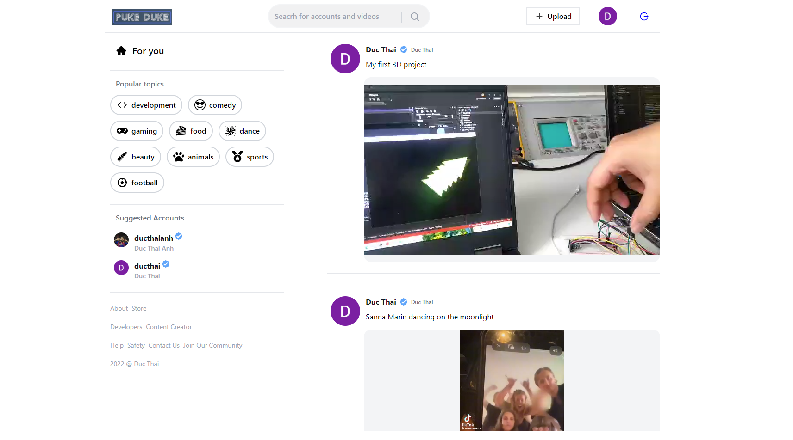
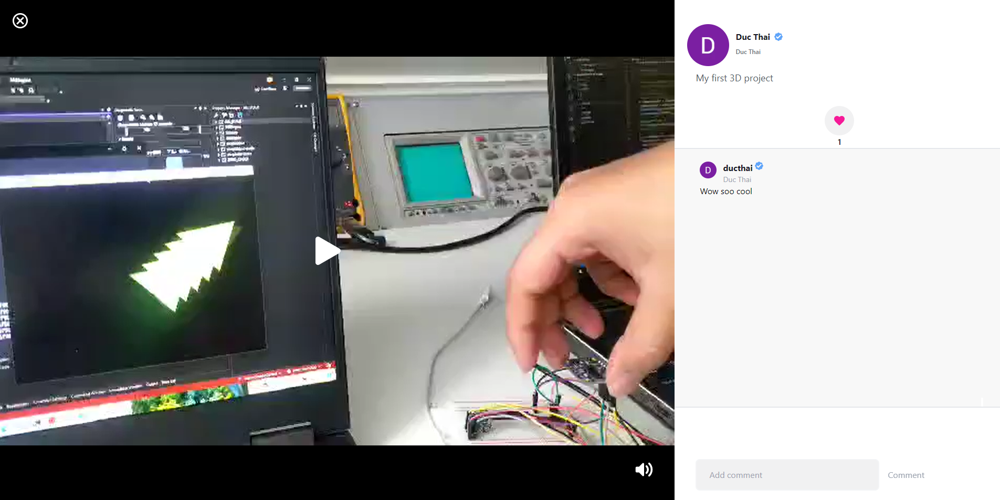

This is a [Next.js](https://nextjs.org/) project bootstrapped with [`create-next-app`](https://github.com/vercel/next.js/tree/canary/packages/create-next-app).

## Tiktok Clone - Puke Duke Version

* Video sharing application with UI/UX inspired by Tiktok
* Database: Sanity 
* Google Authentication and Authorization 
* Like and Comment Videos
* Seach and View Profiles functionality enabled



First, run the development server:

```bash
npm run dev
# or
yarn dev
```




Open [http://localhost:3000](http://localhost:3000) with your browser to see the result.


## Deploy on Vercel


Check out the live application  [Tiktok Clone - PukeDuke Version](https://tiktok-clone-pukeduke12.vercel.app/) for more details.
